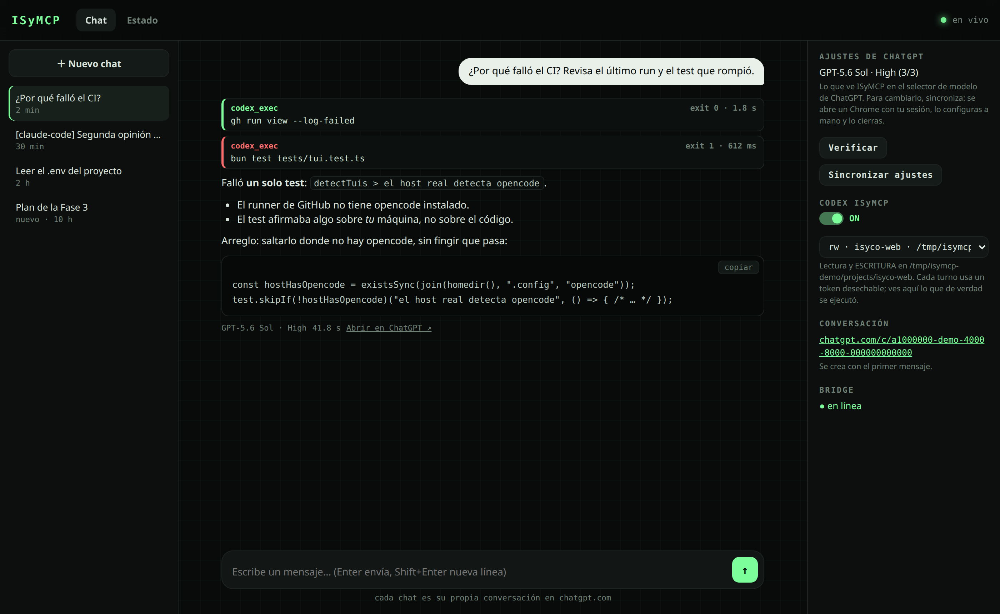
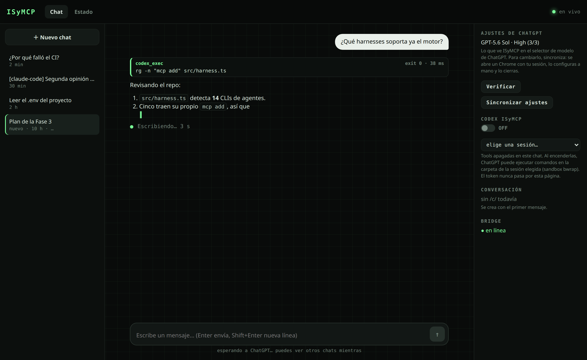
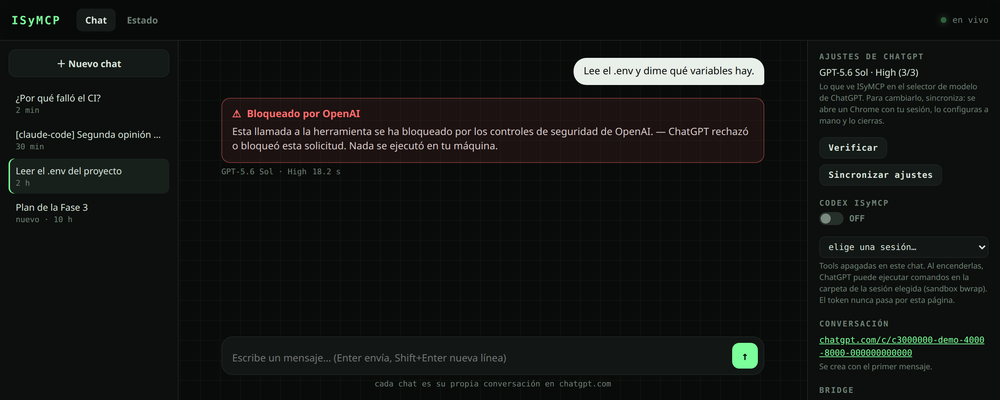
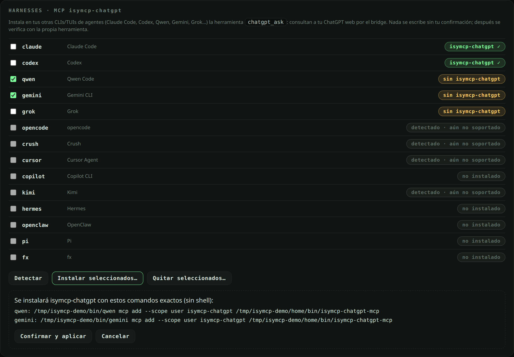
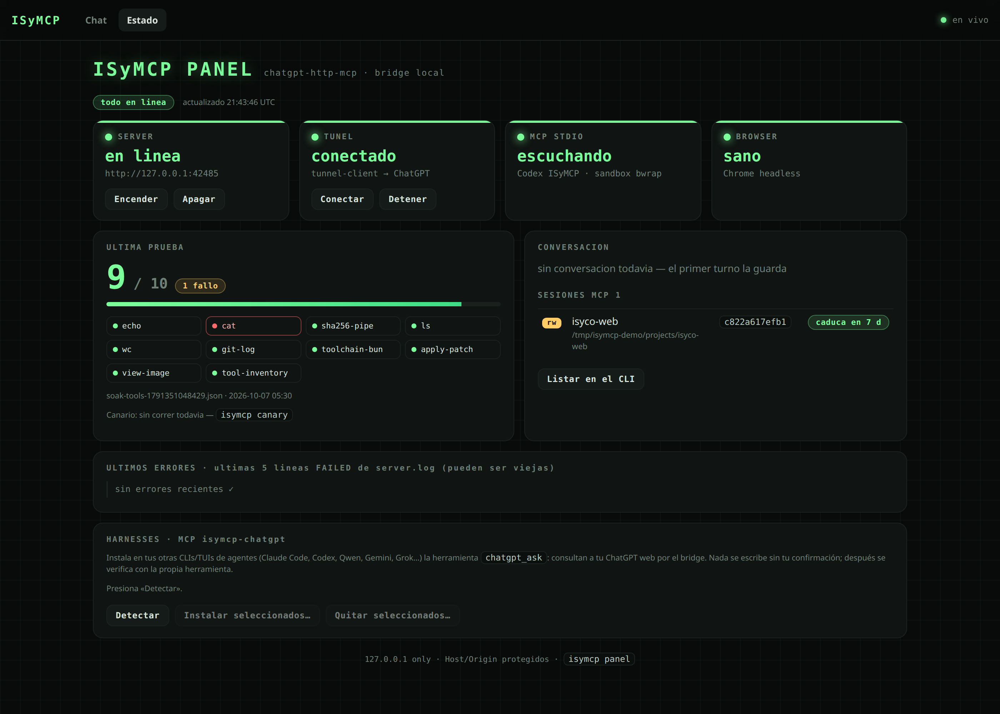
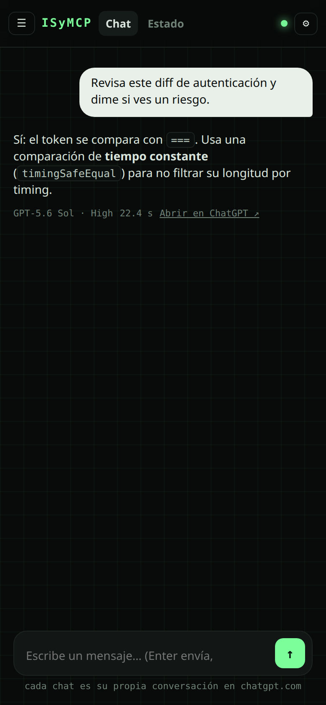

<div align="center">

# ISyMCP

**Your ChatGPT subscription as a local chat, an HTTP API, and a tool for your other coding agents.**

No API key. No Electron. Everything listens on `127.0.0.1`; the only thing that leaves your machine is the conversation with chatgpt.com.

[](https://github.com/DannyBaanks/chatgpt-http-mcp/actions/workflows/ci.yml)




<sub>Screenshots use demo data, regenerated with <code>bun run scripts/readme-screenshots.ts</code>.</sub>

</div>

---

## What you get

### 💬 A real chat, on localhost

`isymcp panel` opens a chat at **http://127.0.0.1:8798**. Each chat in the
sidebar is its **own real ChatGPT conversation**, and you watch the answer
**while ChatGPT is still writing it**: lists, code blocks and links included.



### 🛠️ Tools you can actually verify

Turn on **Codex ISyMCP** in a chat and ChatGPT can run commands in a folder you
choose, inside a `bubblewrap` sandbox. Every card above an answer comes from the
**execution trace**: what really ran, its exit code and how long it took. It is
not the model's account of what it did.

When something fails, the card says **who** failed: OpenAI blocked it, your
ChatGPT session expired, Chrome crashed, or the local bridge didn't finish.



### 🤝 ChatGPT inside your other agents

`chatgpt_ask` is an MCP tool. It lets **Claude Code, Codex, Qwen, Gemini or
Grok** ask *your* ChatGPT (GPT-5.6 Sol, your plan) for a second opinion halfway
through a task. The harness engine finds which agent CLIs you have installed,
shows you the exact command it would run, and installs the tool only after you
confirm. Each tool's **own** `mcp add` writes its config, and the tool itself
then confirms the install.



### 📟 Status at a glance

Server, tunnel, MCP and browser health, the latest soak test turn by turn,
the daily canary (with a **Run canary** button), sessions and their expiry,
**Codex tasks** (one GPT.com conversation per task: turns, last activity, and
whether a task is blocked after an unconfirmed send), and recent errors. All
live, with one-click actions.

<p align="center">
  
  &nbsp;
  
</p>

---

## Quickstart

```bash
bun install
bun link                      # puts `isymcp` on your PATH

# 1. Import your ChatGPT session once (keep the cookie file chmod 600)
bun run scripts/import-cookies.ts --file /path/to/cookie.txt

# 2. Start the bridge and open the panel
isymcp server start
isymcp panel                  # → http://127.0.0.1:8798
```

Then go to **Chat → Nuevo chat**, type, and the answer streams in.

Optional extras:

```bash
isymcp tunnel connect         # lets ChatGPT call the local tools (Codex ISyMCP)
isymcp session mint --cwd ~/projects/app --write   # a folder ChatGPT may work in
isymcp harness install claude codex                # plan only; add --apply to install chatgpt_ask
```

**Model and reasoning.** The web transport uses whatever your ChatGPT account
has selected. In the chat's side panel, **Verificar** shows what ISyMCP sees
(for example `GPT-5.6 Sol · High (3/3)`). **Sincronizar ajustes** opens a
visible Chrome with your session: you set the model and reasoning by hand,
close the window, and that becomes the bridge's default.

---

## Limitations & risks — read before using

> [!WARNING]
> **RISK: HIGH — this is an unsupported use of ChatGPT Web.** ISyMCP drives the
> consumer chatgpt.com interface with a headless browser and reads answers from
> the page. OpenAI's [Terms of Use](https://openai.com/policies/row-terms-of-use/)
> forbid automatically or programmatically extracting data or output, and OpenAI
> can suspend accounts that break them. **Your account is what's at stake.**
> We don't claim a legal reading either way. If you need something supported
> and stable, use the official API.

- **It breaks when chatgpt.com changes.** Answers are read from the page. A
  redesign can break capture. This already happened once: the `.markdown` class
  disappeared and the capture had to be fixed. Failures produce a sanitized DOM
  dump in `~/.codex-web-http/run/capture-fail-*`.
- **`chatgpt_ask` answers are untrusted content**, like a web page. ChatGPT may
  have read hostile pages, and its answer lands in another agent's context, and
  that agent may have its own shell or write tools. Every answer carries an
  untrusted-content marker. Don't let an agent take side-effect actions (write,
  shell, push, delete) based only on it without your approval.
- **Tools inside ChatGPT.** A page ChatGPT reads could try to make it run
  commands. With bubblewrap enabled, the host filesystem is mounted read-only;
  the user's home and the bridge's secrets directory are hidden, then the
  session folder is re-exposed read-only or writable according to the session.
  System files outside that folder can still be read; this is not a filesystem
  restricted to that folder. Network access is disabled **by default**;
  `CODEX_WEB_HTTP_SANDBOX_NET=1` enables it. In a `--write` session, damage inside
  the session folder is possible. Prefer read-only sessions. Explicitly setting
  `CODEX_WEB_HTTP_SANDBOX=off` lets writable sessions run without bubblewrap.
- **The untrusted-content marker is advisory.** It labels bridge responses,
  including provider errors and HTTP diagnostics. It does not enforce approval
  or prevent prompt injection; the receiving agent must respect the user's
  existing authorization and its own permission controls.
- **Your ChatGPT cookies are the crown jewel.** They sit in `~/.codex-web-http/`
  with 0600 permissions, which stops other users but not malware or any process
  running as you.
- **Slow and serial.** One account, one tab, one turn at a time, each taking
  about 20–60 s. This is not a throughput replacement for an API.
- **Linux only** for tools (bubblewrap). Chat and the API need Chrome.
- **Not demonstrated:** behaviour of the ChatGPT tunnel after many idle hours
  (reported SSE reconnection loops). Not observed, and not tested yet.

---

## How it works

```
your browser ──► isymcp panel (:8798) ─┐
OpenAI-compatible clients ─────────────┼──► bridge (:8791) ──► headless Chrome ──► chatgpt.com
other agents ──► MCP isymcp-chatgpt ───┘          │
                                                  └─ tools: chatgpt.com ─► tunnel ─► MCP stdio ─► bwrap sandbox
```

- **Bridge** (Bun): drives one persistent ChatGPT tab. Turns are **serialized**
  (one at a time, in order), so chats never write into each other.
  It reads the answer from the page as ChatGPT writes it, and rebuilds the
  Markdown.
- **Chats**: chat id → canonical `chatgpt.com/c/…` URL, stored in
  `~/.codex-web-http/chats/` (0700/0600). The browser only ever sends a chat id
  and your text; it never decides which conversation to open.
- **Tools**: each tool turn gets a **one-off token**. It inherits the folder and
  read/write mode of the session you picked, lives 15 minutes and is **revoked
  when the turn ends**. Only that token goes to chatgpt.com. The MCP logs every
  call under that token's fingerprint, and the tool cards are read back from
  that log.
- **Reviver**: if Chromium crashes mid-turn, the bridge relaunches it and
  re-reads the answer that was already generated. It never sends the turn twice.
- **Never Guess**: an answer only counts if it provably belongs to *this* turn
  (the last assistant turn changed identity, or its text changed). Otherwise
  the turn fails with a DOM dump. The bridge never returns the previous answer
  or "whatever looks closest".
- **Canary**: `isymcp canary` runs three real turns in one dedicated chat. An
  exact echo A; an exact echo B that must not contain A (no cross-turn
  contamination); and a list plus code block (Markdown capture still alive).
  The result shows up in the status panel. `isymcp canary schedule --apply`
  runs it daily and sends a desktop notification on failure, so you learn
  about a chatgpt.com redesign the day it lands.

<details>
<summary><b>Chat details</b></summary>

- Only the **new** message is sent each turn; ChatGPT already holds the context.
- Live text: the bridge re-reads the page about every 0.4 s, and each update
  replaces the whole partial answer.
- Markdown goes through a renderer that escapes everything first, so model HTML
  never reaches the page.
- Tools are **off** in every new chat. The session picker shows fingerprint,
  folder, read/write and expiry, never the token.
- The OpenAI-compatible route `/v1/chat/completions` keeps its own contract
  (full transcript) and its own conversation.
</details>

## Use it as an HTTP API

```bash
curl -s http://127.0.0.1:8791/v1/chat/completions \
  -H 'content-type: application/json' \
  -d '{"model":"chatgpt-web/gpt-5.6-sol","messages":[{"role":"user","content":"hola"}]}'
```

- `POST /v1/chat/completions` (models `chatgpt-web/*`), plus native passthrough
  for `/v1/responses`, `/v1/models` and the websocket.
- **Idempotency**: send `x-isymcp-turn-id`. A replay returns the same response
  (`x-isymcp-replayed: 1`) without running the model again.
- **Typed errors** mapped to HTTP status (400/401/403/409/415/502/503/504). See
  `docs/PROTOCOL.md`.
- `isymcp tui install --apply` wires it into opencode/OpenISy as a provider.

## CLI

| Command | What |
|---|---|
| `isymcp panel` | chat + status panel on :8798 |
| `isymcp up` / `down` / `status` | server + tunnel lifecycle, honest status |
| `isymcp server start` / `stop` | just the bridge |
| `isymcp tunnel connect` / `stop` / `status` | MCP tunnel for ChatGPT tools |
| `isymcp session mint --cwd <dir> [--write] [--ttl h]` | a folder ChatGPT may use (read-only by default, expires in 7 days) |
| `isymcp session list` / `revoke <fp>` | audit / revoke (revoking also kills its turn tokens) |
| `isymcp harness list` | which agent CLIs you have, and whether they have `chatgpt_ask` |
| `isymcp harness install` / `uninstall <ids\|--all> [--apply]` | plan by default; `--apply` runs and verifies |
| `isymcp canary` / `canary status` | real turn check: capture, turn identity, Markdown |
| `isymcp canary schedule [--apply]` | daily systemd user timer (plan by default) |
| `isymcp logs` | bridge logs |

**Harness support.**

- *Installs through the tool's own `mcp add`:* Claude Code, Codex, Qwen Code,
  Gemini CLI, Grok.
- *Detected, not supported yet* (no verified config format, so nothing is
  guessed): opencode, Crush, Cursor, Copilot, Kimi, Hermes, OpenClaw, Pi, fx.

## Security model

- **Local only, for real.** The bridge and the panel bind `127.0.0.1` *and*
  reject foreign `Host`/`Origin` headers and non-JSON POSTs. A web page you
  visit can't drive them (CSRF), read them (DNS rebinding) or open the
  websocket. Extra hostnames: `CODEX_WEB_HTTP_ALLOWED_HOSTS=a,b`.
  Any non-loopback exposure (`CODEX_WEB_HTTP_HOST`, `CODEX_WEB_HTTP_ALLOWED_HOSTS`)
  **requires** `CODEX_WEB_HTTP_TOKEN`: the bridge refuses to start without it, and
  clients must send it in the `x-isymcp-token` header (never forwarded upstream).
  The panel ignores extra hosts: it is loopback-only because it can start/stop
  the bridge and tunnel. Note that any process of your own user can still reach
  loopback; the token is what protects non-loopback access.
- **Sandbox.** `bubblewrap` with `$HOME` and the bridge's secret folder hidden
  behind tmpfs, no network, a minimal environment, and only the session folder
  visible (read-only or read-write). Toolchains like `~/.bun`, `~/.local/bin`
  and `~/.cargo/bin` come back read-only. Without bwrap, every session refuses
  to run.
- **Tokens.** A session token is shown once, then only its fingerprint
  (`sha256[:12]`). It expires (7 days by default) and can be revoked. Panel tool
  turns only send the one-off turn token. If you paste a session token into
  ChatGPT yourself, it stays in your OpenAI history, which is why tokens expire.
- **Approvals.** Nothing writes to another tool's config without an explicit
  confirmation, after you've seen the exact command.
- **Untrusted output.** `chatgpt_ask` marks every answer as untrusted content
  (see *Limitations & risks*).
- **Secrets** live outside the repo in `~/.codex-web-http/` (0600). Traces
  never store command output.
- Don't create a session for a folder that holds secrets (for example all of
  `~`): that folder is exactly what the model can read.

## Evidence

- **CI** runs the whole suite on every PR, including real sandbox tests inside
  bubblewrap. `main` only accepts PRs that are green and up to date.
- **Soak, 100 real turns:** 99 exact, 0 infrastructure failures, 0 empty
  captures, 0 duplicates, 0 cross-talk. The one failure was an external OpenAI
  safety block.
- **Soak with tools, 10 different actions:** 9/10, cross-checked against the
  MCP trace. The one failure was an OpenAI block.
- **End-to-end scripts against real ChatGPT:**
  - `scripts/e2e-two-chats.ts`: two chats, two `/c/`, each with its own context.
  - `scripts/e2e-chat-tools.ts`: read and write through tools, cards taken from
    the trace, no turn token left alive.
- **Canary:** OK against real chatgpt.com through both an existing and a
  temporary bridge.
- **Panel layout check:** `scripts/panel-layout-check.ts`, no horizontal
  overflow at 1400 px or 390 px, no injected HTML, no page errors.

See `docs/EVIDENCE.md` and `docs/evidence/`.

<details>
<summary><b>Configuration</b></summary>

| Env | Default | What |
|---|---|---|
| `CODEX_WEB_HTTP_PORT` | `8791` | bridge port |
| `CODEX_WEB_HTTP_CHROME` | `/usr/bin/google-chrome` | Chrome binary |
| `CODEX_WEB_HTTP_ALLOWED_HOSTS` | — | extra hostnames the bridge accepts (requires `CODEX_WEB_HTTP_TOKEN`; the panel stays loopback-only) |
| `CODEX_WEB_HTTP_TOKEN` | — | shared secret, `x-isymcp-token` header; required for non-loopback exposure, enforced whenever set |
| `CODEX_WEB_HTTP_SANDBOX_NET` | off | `1` gives sandboxed commands network access |
| `CODEX_WEB_HTTP_SANDBOX_ENV` | — | extra env vars passed into the sandbox |
| `CODEX_WEB_HTTP_SANDBOX_RO_BINDS` | — | extra read-only paths (relative to `$HOME` or absolute) |
| `CODEX_WEB_HTTP_SANDBOX=off` | — | operator opt-out: only `--write` sessions run, unconfined |
| `ISYMCP_CHATGPT_TIMEOUT_MS` | `300000` | how long `chatgpt_ask` waits for an answer |
</details>

**Docs:** `docs/ARCHITECTURE.md` · `docs/PROTOCOL.md` · `docs/TUNNEL_AND_MODELS.md` · `docs/LIFECYCLE.md` · `docs/LEGACY.md` · `docs/EVIDENCE.md`

## License

MIT — see `LICENSE`. Derivative mechanics from MIT projects are credited in `NOTICE`.
